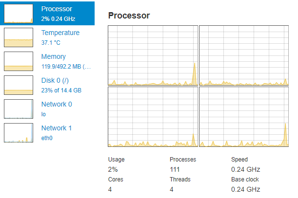

# OctoPrint-Resource-Monitor [](https://www.paypal.com/cgi-bin/webscr?cmd=_s-xclick&hosted_button_id=UD54SHVYDV6NU&source=url)

This plugin adds a neat tab containing various information and graphs about your system resource usage.

It displays information about your CPU, memory, disks and network usage.

## Screenshot



## Setup

Install via the bundled [Plugin Manager](https://github.com/foosel/OctoPrint/wiki/Plugin:-Plugin-Manager)
or manually using this URL:

    https://github.com/Renaud11232/OctoPrint-Resource-Monitor/archive/master.zip

## Configuration

You can select which devices you want to filter out so they are not shown.
This might be useful, for instance, if you have multiple network interfaces but only want to show one.

All can be configured directly though the *Settings* menu. or via the [config.yaml](https://docs.octoprint.org/en/master/configuration/config_yaml.html)

```yaml
plugins:
  marlin_flasher:
    network:
      exceptions:
        - lo
        - eth0
    disk:
      exceptions:
        - /media/example
```

## Need help ?

If you need help please [open an issue](https://github.com/Renaud11232/OctoPrint-Resource-Monitor/issues/new).

## Donations

If you like what I have done and feel generous, you can thank me by [donating](https://www.paypal.com/cgi-bin/webscr?cmd=_s-xclick&hosted_button_id=UD54SHVYDV6NU&source=url). Any amount is fine, I'll still be very thankful.
